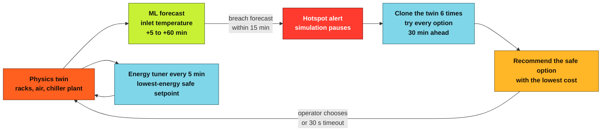
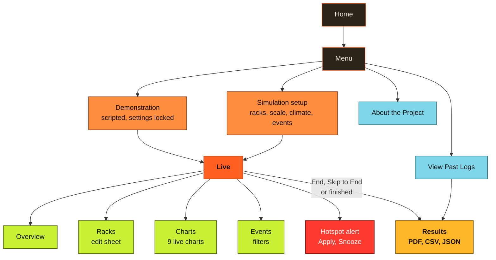
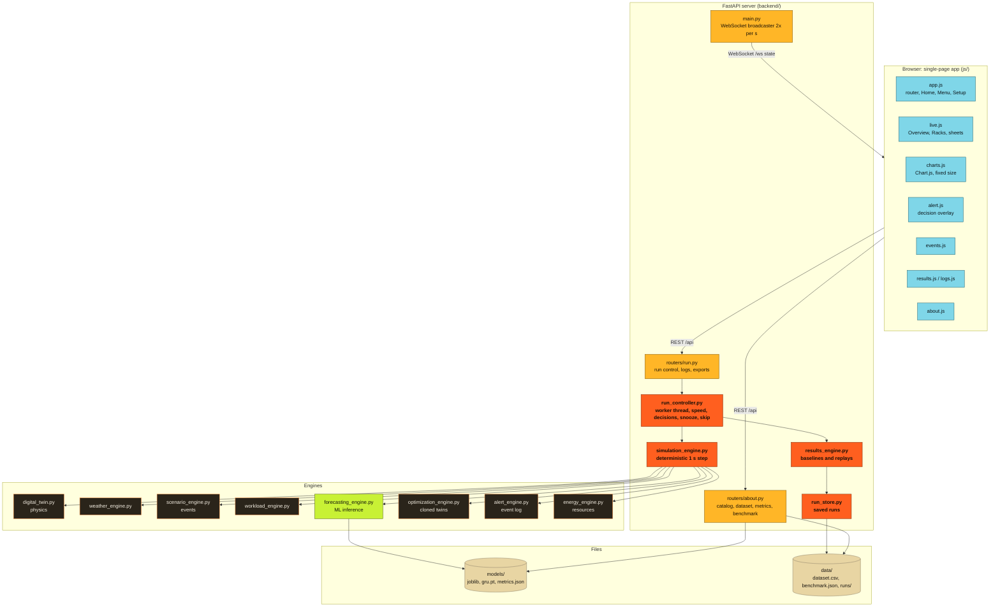
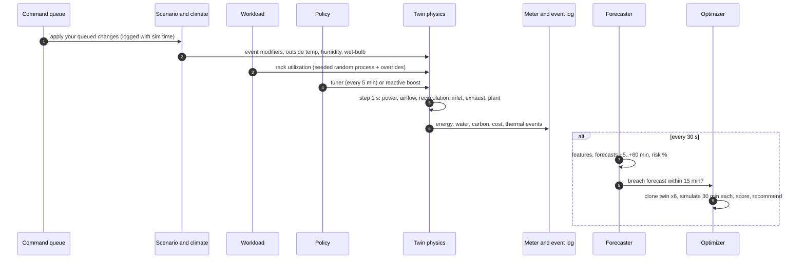
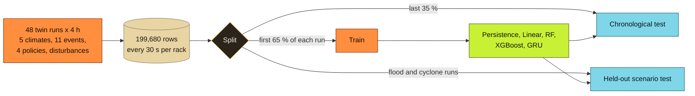

<div align="center">

# Data Center Digital Twin

### Predict rack hotspots before they happen, and cool only as much as needed

A physics-based digital twin of a small data hall, with machine-learning forecasts of rack inlet
temperature and counterfactual testing of cooling decisions in cloned twins.


</div>

---

## Contents

| | Section | What you will find |
|:-:|---|---|
| 1 | [What it does](#1-what-it-does) | The problem and the idea in one page |
| 2 | [Quick start](#2-quick-start) | Install, run, test |
| 3 | [Using the app](#3-using-the-app) | Every screen and button |
| 4 | [Architecture](#4-architecture) | How the pieces talk to each other |
| 5 | [How one simulated second works](#5-how-one-simulated-second-works) | The step pipeline |
| 6 | [The physics](#6-the-physics) | Rack, air and cooling-plant model |
| 7 | [Forecasting](#7-forecasting) | Dataset, models, accuracy |
| 8 | [Decisions and the optimizer](#8-decisions-and-the-optimizer) | Hotspot alerts, solutions, snooze |
| 9 | [Results, reports and past logs](#9-results-reports-and-past-logs) | What is measured and exported |
| 10 | [Benchmark](#10-benchmark) | Comparison with conventional cooling |
| 11 | [Project structure](#11-project-structure) | Every file and what it does |
| 12 | [API reference](#12-api-reference) | REST and WebSocket endpoints |
| 13 | [Testing](#13-testing) | pytest and the browser check |
| 14 | [Limitations](#14-limitations) | What the twin does not do |

---

## 1. What it does

> **The problem.** Data centers spend a large share of their electricity on cooling, and many keep the air
> colder than necessary because they cannot see trouble coming. When a rack's **inlet** air (the air its servers
> breathe) goes above the ASHRAE recommended **27 C**, equipment is at risk.



| Feature | Detail |
|---|---|
| **Live twin** | 4 to 12 racks in two rows, inlet and exhaust temperatures, workload, power, airflow, recirculation, a water-cooled chiller with cooling tower and free cooling |
| **Forecasts** | Persistence, Linear, Random Forest, XGBoost and GRU models, each trained per horizon on rack **inlet** temperature |
| **Hotspot decisions** | Six options simulated in cloned twins, safety first, then energy, temperature margin and disruption |
| **Events** | Cooling failure, power loss, heatwave, workload spike, flood, wildfire smoke, earthquake, cyclone, containment breach, fan degradation, rack overload |
| **Climates** | Temperate, coastal monsoon, hot desert, Nordic cold, extreme humid heat, each with a daily cycle |
| **Resources** | Energy split (chiller, fans, pumps), PUE, water (WUE), carbon (India grid factor), cost in INR |
| **Fair comparison** | Every run is replayed with fixed and reactive cooling on the same seed and events |
| **Reports** | Results page plus PDF, CSV and JSON exports with an explanation for every number |
| **Past logs** | Every finished run is saved and can be reopened and exported again |

---

## 2. Quick start

```bash
git clone https://github.com/darshsaraf06/ML-Enhanced-Data-Center-Digital-Twin-Prototype.git
cd ML-Enhanced-Data-Center-Digital-Twin-Prototype
git checkout feature/digital-twin-v3
```

The trained models (`backend/models/`), the dataset (`backend/data/dataset.csv`), its summary and the benchmark
results are included, so the app works straight after installing the requirements. Run
`scripts/train_models.py` only if you want to rebuild them.

<details open>
<summary><b>Windows (PowerShell)</b></summary>

```powershell
python -m venv venv
venv\Scripts\python -m pip install -r backend\requirements.txt
venv\Scripts\python -m playwright install chromium        # only for the browser checks
venv\Scripts\python -m uvicorn main:app --app-dir backend --host 127.0.0.1 --port 8000 --reload
```
</details>

<details>
<summary><b>Linux / macOS</b></summary>

```bash
bash start.sh          # creates ./venv on first use, installs requirements, starts the server
```
</details>

<details>
<summary><b>Docker</b></summary>

```bash
docker compose up --build
```
Saved runs, the dataset and benchmark results live in `backend/data`, which is mounted as a volume.
</details>

Open **http://127.0.0.1:8000** and click **Get Started**. Health check: `http://127.0.0.1:8000/api/health`.

| Task | Command |
|---|---|
| Run all tests | `venv\Scripts\python -m pytest tests -q` |
| Browser check (screenshots) | `venv\Scripts\python scripts\ui_check.py` |
| Rebuild dataset and retrain models | `venv\Scripts\python scripts\train_models.py` |
| Re-score saved models only | `venv\Scripts\python scripts\train_models.py --evaluate-only` |
| Run the benchmark | `venv\Scripts\python scripts\run_benchmark.py --seeds 10` |

---

## 3. Using the app



<table>
<tr><th>Screen</th><th>What you can do</th></tr>
<tr><td><b>Setup</b></td><td>Racks (4 to 12), scale, climate, events (None, Random or Choose with <b>Select all</b> / <b>Clear all</b>). Advanced: duration, seed, forecast model (with its accuracy), inlet limit, cost weights, grid factor, prices.</td></tr>
<tr><td><b>Live control bar</b></td><td>Pause / Resume, End (with confirmation), speeds 1x 2x 5x 10x 25x (the label shows the real achieved speed), Skip to End (with progress bar), clock, theme toggle, live ticker.</td></tr>
<tr><td><b>Overview</b></td><td>Hottest inlet, hotspot risk, cooling power, PUE, live forecast accuracy (% within 1 C), outside air, rack heatmap with colour legend, cooling plant facts.</td></tr>
<tr><td><b>Racks</b></td><td>Inlet, exhaust, workload, power, airflow, risk and +5 / +15 / +30 min forecasts per rack. Tap a rack (Simulation mode) to set workload, power cap, local airflow or apply a temperature disturbance.</td></tr>
<tr><td><b>Charts</b></td><td>Inlet per rack with limit line, forecast vs actual with error band, hotspot risk, workload, cooling power split, PUE, weather (two axes), cumulative energy and water. Event markers on every chart.</td></tr>
<tr><td><b>Events</b></td><td>Structured feed: severity and category chips with counts, rack filter, grouped and expandable entries.</td></tr>
<tr><td><b>Environment</b></td><td>Floating button: climate, outside temperature, humidity, and one-tap events. All logged.</td></tr>
<tr><td><b>Hotspot alert</b></td><td>"Rack 06 will reach 29.4 C in about 15 minutes". <b>Apply Recommended</b> and <b>Snooze 5 min</b> at the top, 30 s countdown, solution cards that fill in as each cloned twin finishes.</td></tr>
<tr><td><b>Results</b></td><td>Summary, timeline, workload, resources vs baselines, every alert with all options and the reason, solutions comparison, racks, forecast accuracy, events. Each section has "What this means" and "How each number is calculated".</td></tr>
<tr><td><b>Past Logs</b></td><td>All finished runs, newest first, with key numbers. Open the full results or download PDF, CSV or JSON again.</td></tr>
</table>

---

## 4. Architecture



**Key design choices**

| Choice | Why |
|---|---|
| Fixed **1 s physics step** at every speed | 1x, 25x, Skip to End, baselines and replays give identical results for the same seed |
| Simulation in a **worker thread**, REST only queues commands | The event loop never blocks; commands are applied at an exact simulated second, so they can be replayed |
| **Events build modifiers each step** | A chiller trip or heatwave never overwrites optimizer actions or your rack changes |
| **Same feature code** for training and live inference | The model sees exactly the same inputs in the app as in its dataset |
| WebSocket sends **state plus new chart points** | The UI updates values in place; charts append points instead of being rebuilt |

---

## 5. How one simulated second works



---

## 6. The physics

All parameters are listed in [`docs/MODEL_PARAMETERS.md`](docs/MODEL_PARAMETERS.md) and defined in `backend/model_params.py`.

| Part | Equation (per rack i) | Meaning |
|---|---|---|
| Power | `P = Pmax x (idle + (1 - idle) x utilization)` | Servers draw 25 to 55 % of maximum power when idle |
| Inlet | `inlet = (1 - r) x supply + r x hot aisle + disturbance` | Air entering the rack is supply air mixed with recirculated exhaust |
| Recirculation `r` | 4 % mid-row, 8 % row end, plus `0.9 x airflow shortfall` | Starved racks pull hot air back from the hot aisle |
| Exhaust | `60 kJ/K x d(exhaust)/dt = P - rho cp Q (exhaust - inlet)` | Server thermal mass: changes over 1 to 2 minutes |
| Supply air | `400 kJ/K x racks x d(supply)/dt = load - capacity` | If the plant cannot remove all heat, the room warms (about 1 C per minute after a chiller trip) |
| Chiller COP | `0.25 x T_evap / (T_cond - T_evap)` | Warmer setpoints and cooler wet-bulb make cooling cheaper |
| Free cooling | ramps over 4 K when tower water is colder than chilled water | Nordic climates rarely need the chiller |
| Water | evaporation + blowdown from heat rejected | Litres and WUE |

<details>
<summary><b>Heatmap colour scale</b></summary>

| 18 C | 22 C | 25 C | 27 C (limit) | 30 C | 32 C |
|:-:|:-:|:-:|:-:|:-:|:-:|
|  |  |  |  |  |  |
</details>

---

## 7. Forecasting



- **Target:** change of rack **inlet** temperature after 5, 10, 15, 30 and 60 minutes.
- **Features (25):** current inlet and its 1 and 5 minute trends, exhaust, utilization and its trend, power, airflow ratio, recirculation, supply air and its rate of change, setpoint, spare cooling capacity, chiller and CRAH status, outside dry-bulb and wet-bulb, zone, row position, and the steady-state inlet the air is mixing toward.
- **Accuracy** = share of forecasts within 1 C of what really happened. **Skill** = 1 - model RMSE / persistence RMSE (above 0 beats "no change").
- The live numbers are always read from `backend/models/metrics.json` (About page, Setup and Results show them). R2 looks high for slowly changing temperatures even for weak models, which is why skill and accuracy are shown next to it.
- **Hotspot probability** = max over horizons up to 15 min of `Phi((forecast - limit) / RMSE_h)`, using the measured test error.

---

## 8. Decisions and the optimizer

| Option | What it does |
|---|---|
| No action | Keep everything as it is |
| Boost CRAH airflow | +20 points of design airflow (fan power follows the cube law) |
| Lower setpoint | -2 C supply air (chiller COP drops) |
| Migrate workload | Up to 25 utilization points from the hottest rack to the coolest racks with headroom |
| Cap rack power | Hottest rack at 85 % of its power for 15 minutes |
| Combined | Airflow +10, setpoint -1 C, migrate 15 points |

```text
safe       = forecast peak inlet over 30 min <= limit
cost score = w_energy x energy change % + w_temperature x 10 x max(0, peak - (limit - 2 C)) + w_disruption x disruption
recommended = safe option with the lowest cost (or the lowest peak if nothing is safe)
```

**Alert rules** (so alerts do not repeat continuously):

| Rule | Value |
|---|---|
| Alert when | a rack is forecast above the limit within 15 minutes, or is already above it |
| One alert covers | every rack at risk at that moment |
| Quiet period after any alert | 10 simulated minutes |
| Same rack alerts again | only after it has recovered (0.5 C below the limit, no breach forecast) or after 30 minutes |
| Operator timeout | 30 s, then the recommended option is applied |
| **Snooze 5 min** | dismisses the alert with no action and opens no new alert for 5 minutes of real time; warnings are still logged; "Turn alerts back on" ends it early |
| Skip to End | applies the recommended option automatically |

---

## 9. Results, reports and past logs

Every number comes from the run itself or from replaying the same scenario (same seed, weather, workload, events and your changes):

| Replay | Policy |
|---|---|
| Fixed cooling | 18 C supply, 100 % airflow |
| Reactive cooling | 21 C / 85 %, boost to 17 C / 110 % near the limit |
| Solutions | the project policy answering every alert with one fixed option, and with the recommended option |

The **PDF**, **CSV** and **JSON** exports contain the same sections as the Results page, plus a *Definitions and methods* section that explains every metric, column, option, severity and category. Finished runs are saved in `backend/data/runs/` and listed under **View Past Logs**.

---

## 10. Benchmark

`scripts/run_benchmark.py` simulates five scenarios (normal day, heatwave, chiller trip, workload spike in a coastal monsoon, workload spike in extreme humid heat) for 10 seeds under all three policies. Means, standard deviations and paired savings are shown on the About page and saved in `backend/data/benchmark.json`. This is the only source of comparisons with conventional cooling in the app, including the cases where this project does worse (a sudden chiller trip hits harder when the hall runs warmer to save energy).

---

## 11. Project structure

```text
Data Center/
|-- index.html                  App shell: loads theme.css, Chart.js and js/app.js
|-- theme.css                   Foundry theme: dark and light modes, every component style
|-- js/
|   |-- app.js                  Router, theme toggle, Home, Menu, Setup (with Select all)
|   |-- shared.js               Navigation, catalog cache, theme icons
|   |-- api.js                  REST client and the shared WebSocket
|   |-- util.js                 Formatting, heatmap colour scale, toasts, confirm dialog
|   |-- live.js                 Live screen: control bar, Overview, Racks, sheets, snooze bar
|   |-- charts.js               Nine live charts, event markers, decimation
|   |-- alert.js                Hotspot alert overlay: Apply Recommended, Snooze, countdown
|   |-- events.js               Structured event feed with filters
|   |-- results.js              Results page (current or saved run) with explanations
|   |-- logs.js                 View Past Logs
|   |-- about.js                About the Project, built from live data
|   `-- vendor/chart.umd.min.js Chart.js 4.4.1 (served locally)
|-- backend/
|   |-- main.py                 FastAPI app, WebSocket broadcaster, static files
|   |-- model_params.py         Every physical constant, limit and policy parameter
|   |-- digital_twin.py         Rack, air and cooling-plant physics
|   |-- weather_engine.py       Climates, daily cycle, wet-bulb
|   |-- scenario_engine.py      Events as time-based modifiers, demo script
|   |-- workload_engine.py      Seeded rack utilization
|   |-- alert_engine.py         Structured, grouped event log
|   |-- energy_engine.py        Energy, water, carbon, cost, thermal statistics
|   |-- forecasting_engine.py   Features, model loading, forecasts, risk, live accuracy
|   |-- optimization_engine.py  Options, cloned-twin branches, scoring, tuner
|   |-- simulation_engine.py    Deterministic run: step pipeline, policies, decisions
|   |-- run_controller.py       Live worker thread: speed, pause, decisions, snooze, skip
|   |-- results_engine.py       Baselines, replays, results object, explanations
|   |-- results_export.py       PDF, CSV and JSON exports
|   |-- run_store.py            Saved runs for View Past Logs
|   |-- benchmark_runner.py     Multi-seed benchmark
|   |-- ml_training.py          Dataset generation, training, evaluation
|   |-- ws_manager.py           WebSocket connections
|   |-- routers/run.py          /api/run and /api/runs
|   |-- routers/about.py        /api/catalog and /api/about
|   |-- models/                 Trained models and metrics.json
|   `-- data/                   dataset.csv, dataset_summary.json, benchmark.json, runs/
|-- scripts/
|   |-- train_models.py         Build the dataset and train (or --evaluate-only)
|   |-- evaluate_models.py      Re-score saved models from dataset.csv
|   |-- run_benchmark.py        Benchmark from the command line
|   `-- ui_check.py             Browser check of every screen, both widths and themes
|-- tests/                      pytest: physics, decisions, API, exports, browser tests
|-- docs/MODEL_PARAMETERS.md    Full parameter and equation reference
|-- Dockerfile, docker-compose.yml, start.sh
`-- Data_Center_Digital_Twin_Presentation.pptx, create_presentation.py   Presentation material
```

---

## 12. API reference

<details>
<summary><b>Run control</b> <code>/api/run</code></summary>

| Method | Path | Purpose |
|---|---|---|
| POST | `/api/run/start` | Start a run (config: mode, racks, scale, climate, events, duration, seed, model, limit, weights, prices) |
| POST | `/api/run/pause`, `/resume`, `/end`, `/skip` | Control the run |
| POST | `/api/run/speed` | `{"speed": 1, 2, 5, 10 or 25}` |
| POST | `/api/run/rack/{id}` | Workload, power cap, local airflow, temperature disturbance (403 in Demonstration) |
| POST | `/api/run/environment` | Climate, outside temperature, humidity, trigger an event (403 in Demonstration) |
| POST | `/api/run/decision` | Apply a solution `{"actionId": ...}` |
| POST | `/api/run/snooze`, `/unsnooze` | Snooze alerts for 5 minutes, or end the snooze |
| GET | `/api/run/state`, `/series`, `/results` | Current state, chart history, results status |
| GET | `/api/run/export?format=pdf\|csv\|json` | Export the current results |
</details>

<details>
<summary><b>Past logs</b> <code>/api/runs</code></summary>

| Method | Path | Purpose |
|---|---|---|
| GET | `/api/runs?limit=&offset=` | Saved runs, newest first |
| GET | `/api/runs/{runId}` | Full saved results |
| GET | `/api/runs/{runId}/export?format=pdf\|csv\|json` | Export a saved run |
</details>

<details>
<summary><b>About and catalog</b></summary>

| Method | Path | Purpose |
|---|---|---|
| GET | `/api/catalog` | Climates, events, models with accuracy, options, speeds, limits |
| GET | `/api/about/parameters` | Physics parameters and features |
| GET | `/api/about/ml` | Model metrics |
| GET | `/api/about/dataset`, `/dataset.csv` | Dataset summary and download |
| GET / POST | `/api/about/benchmark`, `/benchmark/run` | Benchmark results, run it again |
| GET | `/api/health` | Server status |
| WS | `/ws` | Live state twice per second |
</details>

---

## 13. Testing

| Suite | Covers |
|---|---|
| `tests/test_live_fixes.py` | State changes every step, realistic inlet temperatures, no alarms in a normal run, changes persist, chiller trip physics, every model forecasts, Skip equals 1x, alerts spaced out, snooze, live accuracy |
| `tests/test_api.py` | Health, static files only, demo 403s, rack updates, background skip, exports with explanations, saved runs, snooze, accuracy in the catalog |
| `tests/test_text_rules.py` | No em dash and no emoji in the app or backend messages |
| `tests/test_ui.py` | Browser: values change at 1x, slider keeps 90 %, charts keep size, heatmap colours, Skip opens Results, Select all, alert buttons on top and snooze, Past Logs |
| `scripts/ui_check.py` | Every screen at 390 px and 1920 px in dark and light mode: no console errors, failed requests, overflow or small buttons; screenshots in `artifacts/screens/` |

---

## 14. Limitations

- Reduced-order physics (a few temperatures per rack), not CFD. Parameters are typical engineering values that must be calibrated against real telemetry.
- Models are trained on twin-generated data; their accuracy on a real building is unknown until retrained on measured data.
- Counterfactual branches hold current conditions constant, so they cannot anticipate events that have not started.
- Water figures assume a cooling tower; the carbon factor is a national grid average (check the latest CEA release).
- Workload is a seeded synthetic process; using a public cluster trace (Google or Alibaba) is future work.

<div align="center">


</div>
